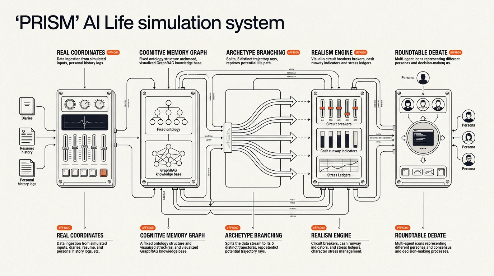

<p align="center">
  
</p>

<p align="center">
  <a href="https://github.com/zhaopeizhao41-ops/PRISM"></a>
  <a href="https://www.python.org/"></a>
  <a href="https://vuejs.org/"></a>
  <a href="https://github.com/zhaopeizhao41-ops/PRISM/blob/main/LICENSE"></a>
  
  
</p>

<p align="center">
  <b>一束光穿过棱镜，折射出无数条路径。你的人生也是。</b><br>
  <b>宇宙充满混沌，但我们始终拥有选择。</b><br>
  <i>一个受真实性账本与因果律硬约束的个人人生推演与平行宇宙决策实验室。</i>
</p>

<p align="center">
  <a href="#创作初衷与设计哲学">创作初衷</a> •
  <a href="#核心管线">核心管线</a> •
  <a href="#全格式资料解析">资料解析</a> •
  <a href="#核心特性">核心特性</a> •
  <a href="#系统架构">系统架构</a> •
  <a href="#快速开始">快速开始</a> •
  <a href="README.md">English README</a>
</p>

---

## 创作初衷与设计哲学

> *“我们建造 PRISM，始于一个极其私人的时刻。那时我和朋友都站在人生的分水岭上，感受到的不是戏剧性的抉择，而是一种更安静、更令人窒息的东西——**混沌**。未来像一团浓雾，没有轮廓，没有纵深。我们不是缺少选项，而是被选项的不可见性困住了：不知道门在哪里，不知道每一步的真实代价，不知道自己其实可以走多远。*
>
> *所以我们写下了第一行代码。不是为了预测未来——没有人可以。而是为了**让你看清，从此刻的你出发，世界能展开多大的面积**。”*

**PRISM 不会告诉你该怎么活。** 它做一件更诚实、更有力量的事：
把真实的你——你的技能、资源、约束、恐惧与不可割舍的羁绊——输入多智能体现实模拟引擎，展开所有尚未坍缩的可能性。每一条路径都标注着真实的代价与可能的回报，没有粉饰，没有廉价的乐观主义。

- 🔬 **不是占卜，是模拟**：我们不相信玄学预言，我们相信因果律与客观约束。基于真实认知底账与概率模型运行，每一条路径都可回溯、可量化、可质询。
- 🌌 **混沌不是终点，选择才是**：不确定性从来不等于无能为力。在每一个分叉节点上，你都拥有**真实的、属于你的选择**。迷茫不是因为没有路，而是因为你还没看见它们。
- 🪞 **你比自己以为的更宽广**：大多数人低估了自己人生的可能性面积，因为视野被此刻的焦虑压缩了。从你站立的这个点出发，向外散射出的路径数量，远远超出你的想象。

---

## 核心管线

<p align="center">
  
</p>

```
真实坐标（Word / Excel / PPT / PDF / 聊天记录 / 随笔日记 / 截图照片）
        │
        ▼
个人知识图谱                 （Zep Cloud GraphRAG，固定本体）
        │
        ▼
个人画像深度合成              （三阶段 LLM 合成，版本化 + 内容哈希）
        │
        ├──► 01. 人生分支规划    （5 大原型驱动的平行人生方向）
        │         │
        │         ▼
        │    02. 深度推演状态机   （逐阶段演进 + 真实性账本刚性约束）
        │         │
        │         ▼
        │    03. 平行宇宙对比     （4 维世界状态并排矩阵透视）
        │         │
        │         ▼
        │    04. 多轮圆桌激辩     （关系人智能体 + Letta 记忆 + 主持人交叉审计）
        │         ▼
        │    多种可能的人生        （不为预见未来，只是探索可能）
        │
        └──► 05. 图谱交互观测台   （D3.js 力导向实时图谱可视化）
```

---

## 产品界面实测

| 01. 个人画像与认知底账 | 02. 人生原型分支折射 |
|:---:|:---:|
|  |  |

| 03. 多宇宙深度推演与因果状态机 | 04. 多轮平行圆桌与交叉审计 |
|:---:|:---:|
|  |  |

---

<a name="全格式资料解析"></a>
## 全场景生活资料解析矩阵

PRISM 支持 17 种以上常见个人生活资料与多媒体格式的无门槛直接导入：

| 分类 | 支持格式 | 处理引擎 | 核心场景能力 |
| :--- | :--- | :--- | :--- |
| **主流办公文档** | `.docx`, `.doc`, `.pdf` | `python-docx`, `PyMuPDF` | 本地毫秒级提取求职简历、随笔文章、个人自述及表格中的履历信息。 |
| **表格与财务时间线** | `.xlsx`, `.xls`, `.csv` | `openpyxl`, `csv` | 结构化提取存款账目、开支流水与人生大事件时间表。 |
| **演示文稿** | `.pptx` | `python-pptx` | 自动提取述职报告、个人规划 PPT 的幻灯片要点与演讲备注。 |
| **聊天记录与笔记导出** | `.html`, `.json`, `.txt`, `.log`, `.rtf` | `BeautifulSoup4` + 编码自适应 | 自动清洗 HTML 标签，解析微信/QQ 聊天记录流与 Notion/飞书笔记导出包。 |
| **截图与随拍照片** | `.png`, `.jpg`, `.jpeg`, `.webp` | 多模态 Vision 大模型 (`deepseek-v4-flash-vision-exp` / `qwen-vl` / `gpt-4o`) | 深度 OCR 识别微信聊天长截图、手写日记照片与成绩单/体检单。 |

---

## 核心特性

- **多模态个人画像深度合成**：融合结构化量化问卷与非结构化私密资料，按资料来源信度加权，合成版本化且内容哈希盖章的稳定模型。
- **Character-LLM 亲历情境锚点与防御心理轴**：提取真实的生命记忆锚点与心理防御机制，杜绝角色扁平化与人设漂移，确保推演中的自我始终符合真实性格。
- **Mem0 增量原子记忆突变管线**：在推演每个阶段执行 `ADD`、`UPDATE`、`DELETE`、`NOOP` 原子记忆操作，实现终身记忆图谱动态演进。
- **Letta / MemGPT 分层核心工作记忆**：维护 3 大独立记忆块（`persona` 人格 / `human` 他者认知 / `situation` 局势研判），支持智能体在多轮互动中自主自编辑（`append`/`replace`/`set`）。
- **AI Town 确定性 0-Token 真实感熔断状态机**：物理刚性账本（存款现金流月数、社交张力、身体健康、心理韧性），在发生超支或因果违规时执行确定性阻断，不浪费 LLM Token。
- **AgentVerse 关系人自主意志与现实施压机制**：模拟重要他人（父母、伴侣、合伙人）的自主诉求与边界测试，关系人会主动施加现实张力并挑战不切实际的幻想。
- **多轮平行宇宙圆桌激辩（1-4 轮）**：支持多轮交叉质询、针对性反驳与共识收敛，配备新粗野主义轮次分割带与轮次阶段引导。
- **中立主持人跨轮因果收敛审计**：定量输出收敛指数、宿命必然性、最高杠杆决策支点，一键导出 Markdown 格式的《一页纸人生决策备忘录》。
- **AntiDriftGuard 防漂移保真守卫**：全自动对推演阶段世界状态与圆桌发言进行基线事实比对与声线一致性校验。
- **新粗野主义与纸质仪器视觉**：高对比度设计系统、零 Emoji、物理浮起与硬投影交互反馈，支持中英文全量国际化。

---

## 技术栈

| 层级 | 核心技术 | 作用描述 |
| :--- | :--- | :--- |
| **前端应用** | Vue 3 + Vite | 单页应用，结合 Vue Router 与 Pinia |
| **数据可视化** | D3.js | 交互式力导向本体知识图谱 |
| **后端服务** | Python 3.11+ / Flask | 高吞吐量 RESTful API |
| **多智能体架构** | Stanford GA + Letta + Mem0 | 认知反思、自编辑工作记忆与原子记忆突变 |
| **知识图谱** | Zep Cloud | 基于固定个人本体的 GraphRAG 记忆后端 |
| **大模型推理** | OpenAI 兼容接口 | 实测支持 `deepseek-v4-flash-vision-exp`、`qwen-plus`、`gpt-4o` |
| **存储方案** | 结构化本地 JSON | `uploads/projects/` 下零数据库依赖安全存储 |

---

## 快速开始

### 环境依赖

- **Node.js**: $\ge 18.0.0$
- **Python**: $\ge 3.11, \le 3.12$
- **uv**: 现代高性能 Python 包管理器（[安装指南](https://docs.astral.sh/uv/)）
- **Zep Cloud API Key**: [Zep Cloud 控制台](https://app.getzep.com/)
- **LLM API Key**: 任何兼容 OpenAI 格式的 API Key（如 DeepSeek、阿里百炼 DashScope Qwen 等）

### 1. 克隆代码仓库

```bash
git clone https://github.com/zhaopeizhao41-ops/PRISM.git
cd PRISM
```

### 2. 配置环境变量

在项目根目录下创建 `.env` 文件：

```env
# LLM 模型配置（兼容 OpenAI 协议）
LLM_API_KEY=your_llm_api_key_here
LLM_BASE_URL=https://api.deepseek.com/v1
LLM_MODEL_NAME=deepseek-v4-flash-vision-exp

# Zep Cloud GraphRAG 知识图谱配置
ZEP_API_KEY=your_zep_api_key_here

# 后端服务
PORT=5001
DEBUG=True
```

### 3. 一键安装依赖

```bash
npm run setup:all
```

### 4. 启动本地开发服务

```bash
npm run dev
```

- **前端应用访问**：[http://localhost:3000](http://localhost:3000)
- **后端 REST API**：[http://localhost:5001](http://localhost:5001)

---

## 开源协议

本项目基于 [AGPL-3.0 协议](LICENSE) 开源。
